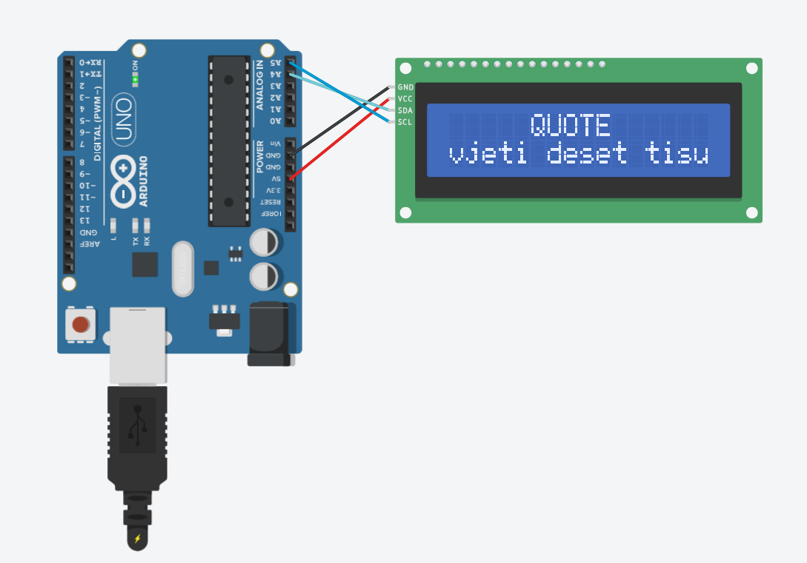

<h1>Scrolling Text Dengan I2C</h1>

# Identitas

Nama         : Muhammad Azka Mauzaky Setyoko  
NIM          : H1D023066  
Mata Kuliah  : Pemrograman Sistem Tertanam

# Deskripsi
Membuat Scrolling (Running) Text menggunakan LCD I2C, terdapat dua baris dimana baris pertama (baris 0) menampilkan kata "Quote" secara statis. Baris kedua (baris 1) menampilkan running text Quote, yang berjalan dari kanan ke kiri.

# Alat dan Bahan

1. Arduino Uno R3
2. LCD 16x2 I2C PCF8574 
3. Kabel Jumper Male to Male

# Tinkercad
<a href="https://www.tinkercad.com/things/c0KDAcaKOiN-exquisite-amur/editel?returnTo=https%3A%2F%2Fwww.tinkercad.com%2Fdashboard">Link Tinkercad</a>

<h2></h2>