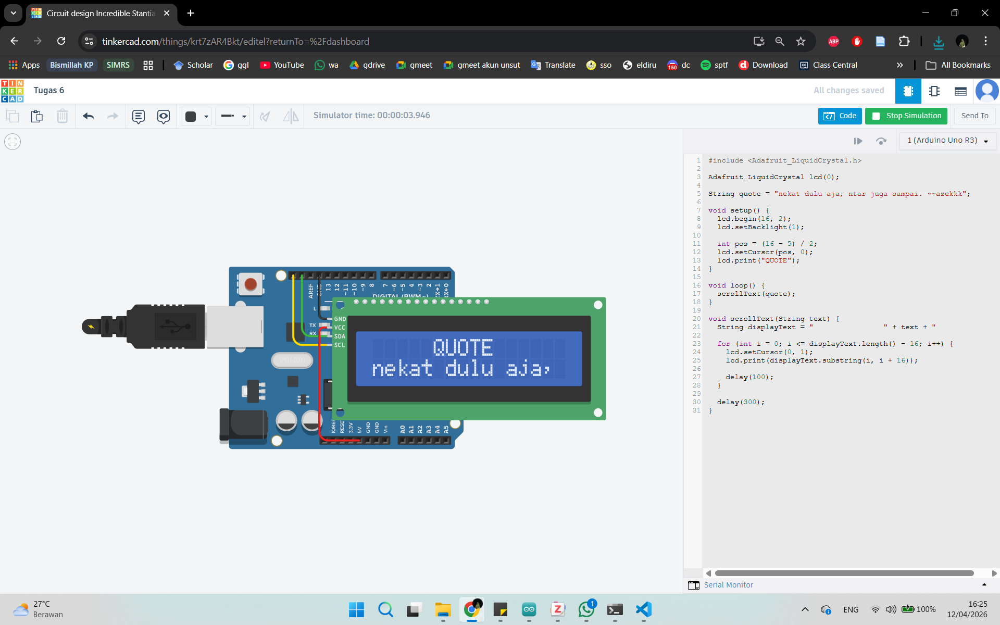
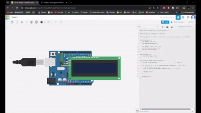

# Scrolling Text Dengan I2C

## Spesifikasi Sistem:
- Terdiri dari 2 Kalimat.
- Kalimat 1 (baris [0]) bertulisan QUOTE, sifatnya statis
- Kalimat 2 (baris [1]) bertulisan Quote nya yang sifatnya dinamis
- Tulisan QUOTE tepat di tengah tampilan LCD
- Tulisan Quote nya pada baris [1] langsung muncul dari sisi kanan (Cursor 15, 1)

## Implementasi
### Alat dan Bahan
1. Arduino Uno
2. LCD 16x2 dengan I2C
3. Kabel Jumper

### Rangkaian
Rangkaian dibuat dengan menghubungkan Arduino Uno dengan LCD 16x2 berbasis I2C. Pin VCC pada LCD dihubungkan ke pin 5V Arduino untuk memberikan tegangan. pin GND dihubungkan ke GND Arduino sebagai referensi ground. Untuk komunikasi data, pin SDA LCD dihubungkan ke pin SDA Arduino dan pin SCL LCD dihubungkan ke pin SCL Arduino. Untuk detail rangkaian dapat perhatikan gambar dibawah:

### Cara Kerja
1. Arduino mengirimkan data melalui jalur SDA
2. Sinyal clock dikontrol melalui SCL
3. LCD menerima data dan menampilkannya pada layar

### Hasil
Hasil Percobaan:  

Simulasi Hasil:  

<h2></h2>

 

  
  
  
  
  
  
  
  
  
  

