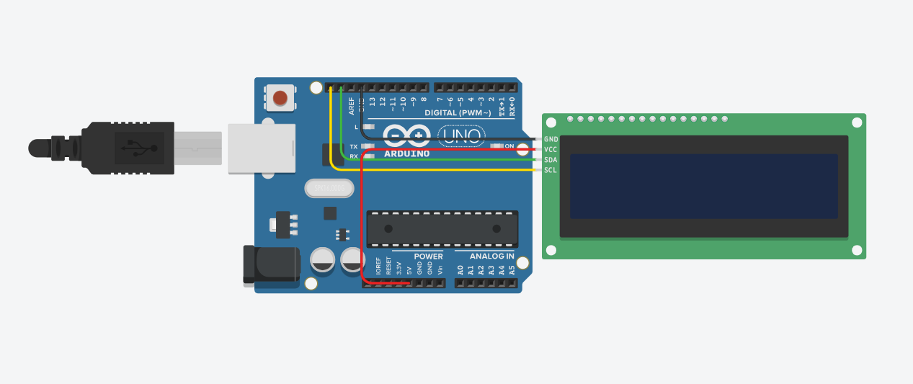

# Tugas 06 — Scrolling Teks Pada LCD I2C

```text
Nama        : Gilang Happy Dwinugroho
NIM         : H1D023015
Mata Kuliah : Pemroggraman Sistem Tertanam (PST)
Kelas       : PST-A
Tugas       : Tugas 06 
```

## Deskripsi Proyek

Proyek ini menampilkan teks berjalan (scrolling text) pada layar LCD 16×2 menggunakan protokol komunikasi I2C. Baris pertama LCD menampilkan label QUOTE secara statis, sedangkan baris kedua menampilkan sebuah kutipan motivasi yang bergerak dari kanan ke kiri.


## Rangkaian (Schematic)

### Komponen yang Digunakan

| Komponen         | Jumlah |
|------------------|--------|
| Arduino Uno      | 1      |
| LCD 16×2 + Modul I2C (MCP23008) | 1 |
| Kabel Jumper     | 4      |

### Koneksi Pin (I2C)

| Pin LCD (Modul I2C) | Pin Arduino Uno |
|---------------------|-----------------|
| GND                 | GND             |
| VCC                 | 5V              |
| SDA                 | SDA Arduino     |
| SCL                 | SCL Arduino     |

### Diagram Rangkaian




## Penjelasan Kode

###  Konfigurasi Konstanta

```cpp
String quoteText   = "Kerja keraslah sampai ...";
const int LCD_COLS    = 16; //jumlah kolom pada lcd
const int SCROLL_DELAY = 280; //jeda antar frame
const int PAUSE_END   = 1200; //jeda setelah teks selesai satu putaran
```

### setup()

```cpp
void setup() {
  lcd_1.begin(16, 2);      // Inisialisasi LCD 16 kolom, 2 baris
  lcd_1.setBacklight(1);   

  lcd_1.setCursor(5, 0);   // Posisi center
  lcd_1.print("QUOTE");    // Tulisan baris 1
}
```

### hapusBaris1()

```cpp
void hapusBaris1() {
  lcd_1.setCursor(0, 1);
  lcd_1.print("                "); // 16 spasi
}
```

Membersihkan seluruh baris kedua LCD dengan mencetak 16 karakter spasi.

### scrollBaris1() 

```cpp
void scrollBaris1(String teks) {
  int panjangTeks = teks.length();
  int totalFrame  = panjangTeks + LCD_COLS;

  for (int frame = 0; frame < totalFrame; frame++) {
    hapusBaris1();

    for (int col = 0; col < LCD_COLS; col++) {
      int idx = frame - (LCD_COLS - 1) + col;
      if (idx >= 0 && idx < panjangTeks) {
        lcd_1.setCursor(col, 1);
        lcd_1.print(teks[idx]);
      }
    }

    delay(SCROLL_DELAY);
  }
  delay(PAUSE_END);
}
```

**Cara kerja algoritma scroll:**

- totalFrame = panjangTeks + LCD_COLS → jumlah total langkah animasi mencakup fase masuk dari kanan hingga keluar ke kiri.
- Setiap iterasi frame merepresentasikan satu "snapshot" dari teks.
- Untuk setiap kolom (col) pada LCD, dihitung indeks karakter (idx) yang harus ditampilkan:
  - idx = frame - (LCD_COLS - 1) + col
  - Jika idx valid (berada dalam rentang teks), karakter dicetak ke posisi tersebut.
- Hasilnya adalah ilusi teks bergerak dari kanan ke kiri, diimplementasikan secara manual frame-by-frame.

### loop()

```cpp
void loop() {
  scrollBaris1(quoteText); // Panggil fungsi scrollBaris1()
}
```

##  Dokumentasi Demo


## Library yang Digunakan

`Adafruit_LiquidCrystal` 

