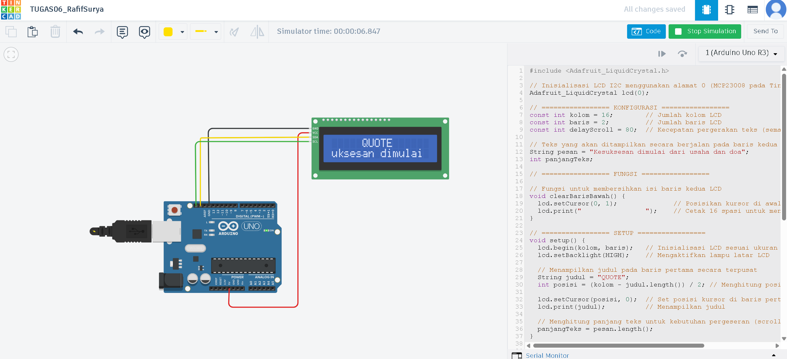
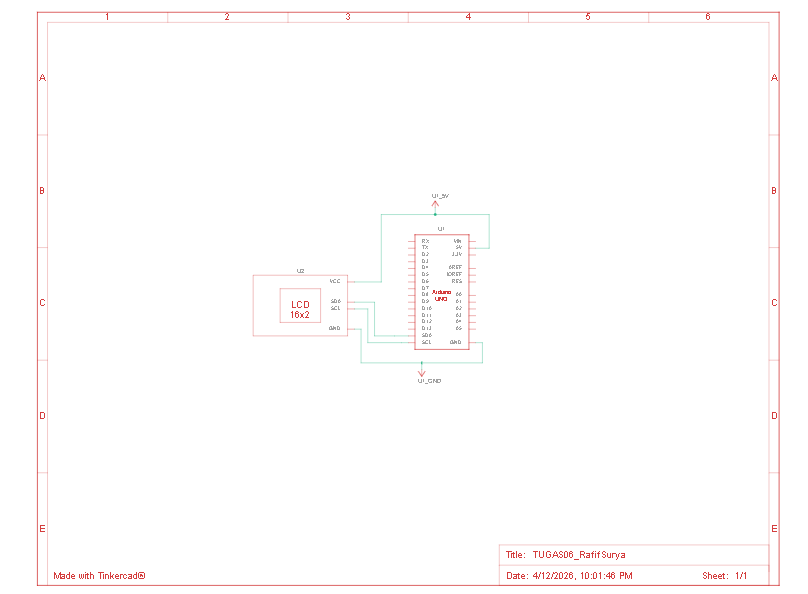

# 📄 Laporan Tugas 06 - Scrolling Text Dengan I2C

**Nama:** Rafif Surya Murtadha  
**NIM:** H1D023008  
**Mata Kuliah:** Praktikum Sistem Tertanam  
**Judul Proyek:** Scrolling Text Display Menggunakan Protokol I2C  

---

## Deskripsi Proyek
Proyek ini bertujuan untuk membuat sistem penampilan teks scrolling (teks berjalan) pada layar LCD 16x2 menggunakan protokol komunikasi I2C (Inter-Integrated Circuit). Sistem ini menghubungkan Arduino UNO dengan modul LCD I2C untuk menampilkan teks yang bergerak dari kanan ke kiri secara dinamis.

---

## Tujuan Pembelajaran
- Memahami komunikasi protokol I2C sebagai alternatif koneksi parallel  
- Menggunakan library Adafruit_LiquidCrystal untuk mengontrol LCD  
- Mengimplementasikan efek animasi text scrolling  
- Mengoptimalkan penggunaan pin microcontroller  

---

## Perangkat Keras (Hardware)

### Komponen yang Digunakan

| Komponen        | Spesifikasi        | Jumlah |
|----------------|-------------------|--------|
| Arduino UNO    | Microcontroller   | 1      |
| LCD 16x2       | Display           | 1      |
| Modul I2C      | MCP23008          | 1      |
| Kabel Jumper   | Koneksi           | Sesuai kebutuhan |
| Power Supply   | 5V                | 1      |

---

## Skema Rangkaian
Foto Tinkercad:  

🔗 https://www.tinkercad.com/things/gVyX1vAlQW1-tugas06rafifsurya

---

## Dokumentasi Gambar

  

---

## Video Dokumentasi

[📹 Lihat Hasil Simulasi]
<video controls src="dokumentasi/HasilSimulasi.mp4" title="Title"></video>
link drive : https://drive.google.com/file/d/1YDhWPy_MHwjP85McK-hojTZUJLD2ikPu/view?usp=sharing 

---

## Koneksi Pin

Arduino UNO ──(I2C)── Modul I2C ──(Parallel)── LCD 16x2  

**Pin Connections:**
- Arduino Pin A4 (SDA) ──► I2C Module (SDA)  
- Arduino Pin A5 (SCL) ──► I2C Module (SCL)  
- Arduino Pin 5V ────────► I2C Module (VCC)  
- Arduino Pin GND ───────► I2C Module (GND)  

**I2C Address:** 0x20  

---

## Perangkat Lunak (Software)

### Library yang Digunakan

#include <Adafruit_LiquidCrystal.h>

Fungsi:  
Mengelola komunikasi I2C dengan LCD 16x2.

Keuntungan:
- Mengurangi penggunaan pin Arduino  
- Komunikasi lebih sederhana (SDA & SCL)  
- Kompatibel dengan modul MCP23008  
- Tersedia fungsi siap pakai untuk tampilan karakter  

Fungsi Penting:
- lcd.begin() → Inisialisasi LCD  
- lcd.setBacklight(HIGH) → Menyalakan lampu latar  
- lcd.setCursor(col, row) → Mengatur posisi kursor  
- lcd.print() → Menampilkan teks  

---

### Penjelasan Kode

**Inisialisasi**
Adafruit_LiquidCrystal lcd(0);  
Digunakan untuk menentukan alamat I2C LCD.

**Setup**
lcd.begin(16, 2);  
lcd.setBacklight(HIGH);  
Mengaktifkan LCD dan lampu latar.

String judul = "QUOTE";  
int posisi = (16 - judul.length()) / 2;  

lcd.setCursor(posisi, 0);  
lcd.print(judul);  

Menampilkan teks "QUOTE" secara statis di tengah baris pertama.

---

### Loop (Scrolling Text)

for (int geser = 0; geser < kolom + panjangTeks; geser++)

Digunakan untuk menggeser teks dari kanan ke kiri.

int posisiAwal = kolom - geser;  
Menentukan posisi awal teks dari sisi kanan LCD.

if (posisiKolom >= 0 && posisiKolom < kolom)  
Menampilkan karakter jika berada dalam area tampilan LCD.

---

### Fungsi Tambahan

void clearBarisBawah()  
Membersihkan baris kedua sebelum update tampilan.

---

## Cara Kerja Sistem
- Arduino dinyalakan  
- LCD diinisialisasi menggunakan I2C  
- Baris pertama menampilkan teks "QUOTE" di tengah  
- Baris kedua menampilkan teks berjalan dari kanan ke kiri  
- Animasi berjalan terus menerus  

---

## Source Code

#include <Adafruit_LiquidCrystal.h>

Adafruit_LiquidCrystal lcd(0);

const int kolom = 16;
const int baris = 2;
const int delayScroll = 80;

String pesan = "Kesuksesan dimulai dari usaha dan doa";
int panjangTeks;

void clearBarisBawah() {
  lcd.setCursor(0, 1);
  lcd.print("                ");
}

void setup() {
  lcd.begin(kolom, baris);
  lcd.setBacklight(HIGH);

  String judul = "QUOTE";
  int posisi = (kolom - judul.length()) / 2;

  lcd.setCursor(posisi, 0);
  lcd.print(judul);

  panjangTeks = pesan.length();
}

void loop() {
  for (int geser = 0; geser < kolom + panjangTeks; geser++) {

    clearBarisBawah();

    int posisiAwal = kolom - geser;

    for (int i = 0; i < panjangTeks; i++) {
      int posisiKolom = posisiAwal + i;

      if (posisiKolom >= 0 && posisiKolom < kolom) {
        lcd.setCursor(posisiKolom, 1);
        lcd.print(pesan[i]);
      }
    }

    delay(delayScroll);
  }

  delay(1000);
}

---

## Hasil Akhir

- Baris 1: "QUOTE" (statis di tengah)  
- Baris 2: "Kesuksesan dimulai dari usaha dan doa" (scrolling)  
- Animasi berjalan dengan halus  
- Sistem berjalan dengan stabil  