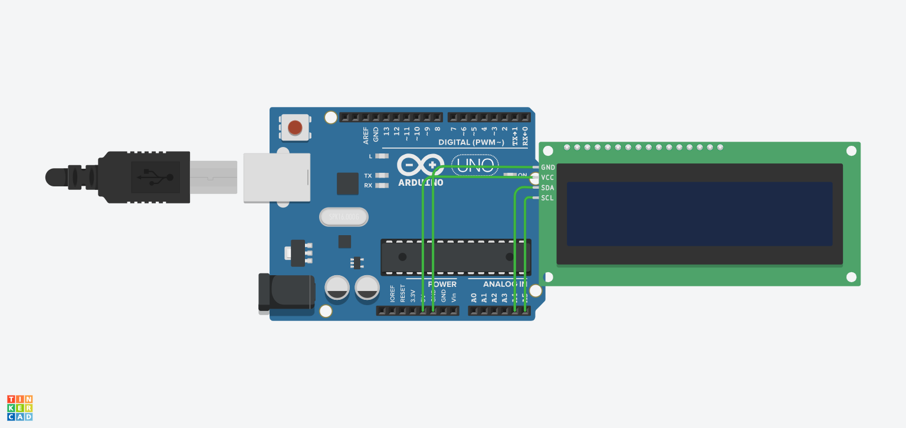

# Tugas 06 PST A - H1D023012

## Identitas

| Field | Keterangan |
|---|---|
| Nama | Renggo Harya Pandora |
| NIM | H1D023012 |

## Deskripsi Program
Program Arduino ini menampilkan teks berjalan pada LCD 16x2 berbasis I2C menggunakan library `Wire` dan `LiquidCrystal_I2C`.

Teks yang ditampilkan adalah:

> "Terbentur, Terbentur, Terbentuk"

Baris pertama LCD menampilkan judul **QUOTE**, sedangkan baris kedua menampilkan karakter quote dari kanan ke kiri (scrolling).

## Library yang Digunakan
- `Wire.h`
- `LiquidCrystal_I2C.h`

## Penjelasan Kode

### 1. Inisialisasi LCD dan variabel
- `LiquidCrystal_I2C lcd(0x27, 16, 2);` membuat objek LCD dengan alamat I2C `0x27`, 16 kolom, 2 baris.
- `String quote` berisi kalimat yang akan di-scroll.
- `textLen` menyimpan panjang string.
- `pos` adalah posisi offset pergeseran teks.

### 2. Fungsi `setup()`
- `lcd.init();` menginisialisasi LCD.
- `lcd.backlight();` menyalakan lampu latar.
- Menampilkan teks `QUOTE` pada baris pertama.
- Menghitung panjang quote dengan `quote.length()`.
- Mengatur posisi awal scroll `pos = 0`.

### 3. Fungsi `loop()`
- Membersihkan baris kedua dengan mencetak 16 spasi.
- Loop `for (int col = 15; col >= 0; col--)` mengisi kolom dari kanan ke kiri.
- `charIndex` menentukan karakter ke berapa dari string yang tampil di kolom tertentu.
- Jika `charIndex` valid, karakter dicetak ke LCD.
- `pos++` menggeser tampilan satu langkah setiap siklus.
- Saat teks sudah lewat seluruh layar (`pos >= textLen + 16`), posisi di-reset ke 0.
- `delay(300);` mengatur kecepatan scrolling, dan `delay(1000);` memberi jeda saat satu putaran selesai.

## Cara Menjalankan
1. Hubungkan LCD I2C ke board Arduino (misalnya Arduino Uno).
2. Pastikan alamat I2C LCD adalah `0x27`.
3. Upload file `Stetch.ino` ke board.
4. Amati tampilan LCD: judul di baris atas dan quote berjalan di baris bawah.

## Hasil

### Video Hasil (MP4)
- [TUGAS06_H1D023012_RENGGOHARYAPANDORA.mp4](./TUGAS06_H1D023012_RENGGOHARYAPANDORA.mp4)

<video controls width="720" src="./TUGAS06_H1D023012_RENGGOHARYAPANDORA.mp4">
  Browser tidak mendukung pemutaran video.
</video>

### Preview Gambar

### Link Simulasi Tinkercad
- https://www.tinkercad.com/things/hIotKKAaoFj/editel?returnTo=%2Fdashboard&sharecode=VqoQc9waEkirX70VtEFcyjI7FVdZUysHRQ6CKFYxFbQ
