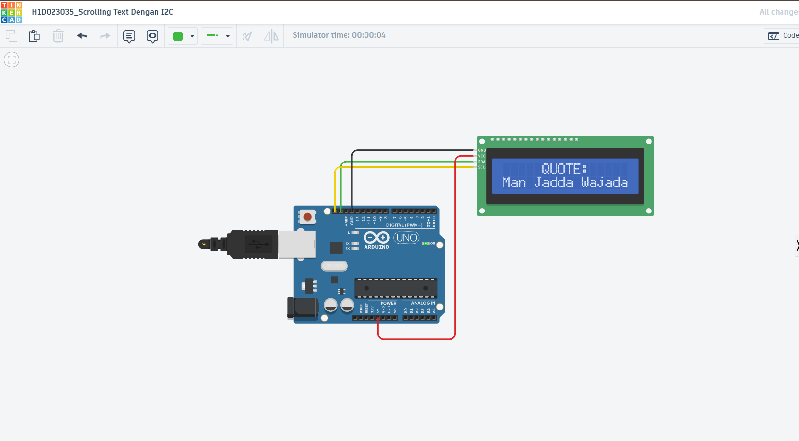

# Laporan Tugas 06 - Scrolling Text Dengan I2C

**Nama:** Dzaky Alfikri  
**NIM:** H1D023035  
**Mata Kuliah:** Praktikum Sistem Tertanam  
**Judul Proyek:** Scrolling Text Display Menggunakan Protokol I2C

---

## Deskripsi Proyek

Proyek ini bertujuan untuk membuat sistem penampilan teks scrolling (teks berjalan) pada layar LCD 16x2 menggunakan protokol komunikasi **I2C (Inter-Integrated Circuit)**. Sistem ini menghubungkan Arduino UNO dengan modul LCD I2C untuk menampilkan quote motivasi yang bergerak dari kanan ke kiri.

### Tujuan Pembelajaran
- Memahami komunikasi protokol **I2C** sebagai alternatif koneksi parallel
- Menggunakan library **LiquidCrystal_I2C** untuk mengontrol LCD
- Mengimplementasikan efek animasi text scrolling
- Mengoptimalkan penggunaan pin microcontroller

---

## Perangkat Keras (Hardware)

### Komponen yang Digunakan
| Komponen | Spesifikasi | Jumlah |
|----------|-------------|--------|
| Arduino UNO | Microcontroller | 1 |
| LCD 16x2 | Display | 1 |
| Modul I2C | Serial Interface | 1 |
| Kabel Jumper | Koneksi | Sesuai kebutuhan |
| Power Supply | 5V | 1 |

### Skema Rangkaian



### Koneksi Pin
```
Arduino UNO ──(I2C)── Modul I2C ──(Parallel)── LCD 16x2

Pin Connections:
- Arduino Pin A4 (SDA) ──► I2C Module (SDA)
- Arduino Pin A5 (SCL) ──► I2C Module (SCL)
- Arduino Pin 5V ────────► I2C Module (VCC)
- Arduino Pin GND ────────► I2C Module (GND)

I2C Address: 0x27 (Default)
```

---

## Perangkat Lunak (Software)

### Library yang Digunakan

#### 1. **LiquidCrystal_I2C.h**
```cpp
#include <LiquidCrystal_I2C.h>
```
- **Fungsi:** Mengelola komunikasi I2C dengan LCD 16x2
- **Keuntungan:**
  - Mengurangi pin yang digunakan dari 6 pin menjadi hanya 2 pin (SDA & SCL)
  - Komunikasi serial lebih efisien
  - Kompatibel dengan berbagai modul I2C
  - Fungsi-fungsi siap pakai untuk tampilan karakter

**Fungsi Penting:**
- `lcd.init()` - Inisialisasi LCD
- `lcd.backlight()` - Nyalakan lampu latar
- `lcd.setCursor(col, row)` - Set posisi kursor
- `lcd.print()` - Tampilkan teks
- `lcd.clear()` - Bersihkan layar

---

## Penjelasan Kode

### Inisialisasi (Setup Phase)

#### 1. **Deklarasi Library dan Objek**
```cpp
#include <LiquidCrystal_I2C.h>

// Inisialisasi LCD dengan alamat I2C 0x27, 16 kolom, 2 baris
LiquidCrystal_I2C lcd(0x27, 16, 2);

// Teks statis untuk baris atas
String top = "QUOTE:";

// Teks dinamis dengan panjang untuk scrolling
String bottom = "Man Jadda Wajada - Barang siapa bersungguh-sungguh, maka ia akan berhasil";
```

**Penjelasan:**
- `LiquidCrystal_I2C(0x27, 16, 2)` → Alamat I2C: 0x27, Kolom: 16, Baris: 2
- `String top` → Teks yang ditampilkan statis di baris pertama
- `String bottom` → Teks yang akan di-scroll di baris kedua

#### 2. **Fungsi Setup()**
```cpp
void setup() {
  // Inisialisasi LCD
  lcd.init();
  
  // Nyalakan backlight (lampu latar LCD)
  lcd.backlight();

  // Hitung posisi tengah otomatis untuk teks "QUOTE:"
  int posisi = (16 - top.length()) / 2;

  // Set kursor ke posisi tengah baris pertama
  lcd.setCursor(posisi, 0);
  
  // Cetak teks "QUOTE:" di tengah
  lcd.print(top);

  // Tambah spasi depan dan belakang agar efek smooth (teks muncul dari kanan)
  bottom = "                " + bottom + "                ";
}
```

**Penjelasan Langkah:**
1. `lcd.init()` - Menginisialisasi komunikasi I2C dengan LCD
2. `lcd.backlight()` - Menyalakan lampu latar agar LCD terlihat
3. `int posisi = (16 - top.length()) / 2` - Menghitung posisi center
   - LCD lebar 16 karakter
   - Teks "QUOTE:" = 6 karakter
   - Posisi center = (16 - 6) / 2 = 5
4. `lcd.setCursor(5, 0)` - Menempatkan kursor di posisi tengah baris pertama
5. `lcd.print("QUOTE:")` - Menampilkan teks di posisi tersebut
6. Menambah spasi di awal dan akhir teks scrolling agar efek smooth

---

### Looping (Loop Phase)

#### Fungsi Loop()
```cpp
void loop() {
  // Perulangan untuk menggeser teks dari kanan ke kiri
  for (int i = 0; i < bottom.length() - 16; i++) {
    
    // Set kursor ke awal baris kedua
    lcd.setCursor(0, 1);
    
    // Ambil substring dari posisi i hingga i+16 (satu baris LCD)
    lcd.print(bottom.substring(i, i + 16));
    
    // Delay untuk mengatur kecepatan scroll
    delay(150); // milliseconds
  }
}
```

**Penjelasan Logika Scrolling:**

1. **Loop Condition:** `i < bottom.length() - 16`
   - `bottom.length()` = panjang total string (termasuk spasi)
   - Contoh: String "                Man Jadda Wajada...                " = ~115 karakter
   - Loop berjalan dari 0 hingga 115 - 16 = 99 kali
   - Ini memastikan seluruh string dapat di-scroll

2. **substring(i, i+16):**
   - Mengambil 16 karakter dari posisi i
   - Contoh iterasi:
     - Iterasi 0: substring(0, 16) = "                " (16 spasi)
     - Iterasi 1: substring(1, 17) = "               M" (15 spasi + M)
     - Iterasi 20: substring(20, 36) = "Man Jadda Wajad" (mulai tampak)
     - ...iterasi terakhir: teks muncul penuh

3. **delay(150):**
   - Menunggu 150 millisecond
   - Semakin besar delay = scroll lebih lambat
   - Semakin kecil delay = scroll lebih cepat

**Visualisasi Scrolling:**
```
Iterasi 0-15  → Spasi dari kanan
Iterasi 16-35 → Teks mulai masuk "M", "Ma", "Man"...
Iterasi ...   → Teks terlihat penuh di tengah
Iterasi akhir → Teks keluar ke kiri, spasi masuk lagi
```

---

## Cara Kerja Sistem

### Urutan Eksekusi
1. **Power On** → Arduino UNO aktif
2. **Setup()** → Jalankan sekali
   - LCD diinisialisasi
   - Koneksi I2C terestablish
   - "QUOTE:" ditampilkan statis di baris 1
   - Teks scrolling siap di-set di baris 2
3. **Loop()** → Jalankan terus menerus
   - Teks scrolling di-update setiap 150ms
   - Efek animasi teks berjalan tercapai

### Timeline Display
```
Waktu 0ms     : "                " (spasi)
Waktu 150ms   : "               M"
Waktu 300ms   : "              Ma"
Waktu 450ms   : "             Man"
...
Waktu ~2000ms : "Man Jadda Wajada" (teks penuh)
...
Waktu ~17000ms: "                " (efek selesai, loop ulang)
```

## Hasil Akhir

Program berhasil menampilkan:
- Baris 1: "QUOTE:" (statis, di tengah)
- Baris 2: "Man Jadda Wajada - Barang siapa bersungguh-sungguh, maka ia akan berhasil" (scrolling)
- Efek smooth dengan delay 150ms per frame
- Komunikasi I2C stabil pada alamat 0x27

---