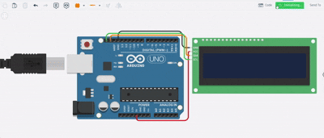

# Tugas 06 - Pemrograman Sistem Tertanam (I2C)

## Implementasi Teks Statis dan Running Text pada LCD 16x2 I2C

Dokumentasi ini berisi penjelasan mengenai proyek simulasi Arduino untuk menampilkan kata mutiara pada LCD 16x2 menggunakan protokol komunikasi I2C.

## Identitas Mahasiswa

* **Nama:** Dhimas Wildan Nur Zakariya
* **NIM:** H1D023050
* **Kelas:** Pemrograman Sistem Tertanam A

## Deskripsi Proyek

Proyek ini bertujuan untuk menampilkan dua jenis teks pada satu layar LCD:

1. **Baris 0 (Atas):** Teks statis bertuliskan **"QUOTE"** yang diposisikan tepat di tengah kolom.
2. **Baris 1 (Bawah):** Teks dinamis (kata mutiara) yang muncul dari sisi kanan layar (kolom 15) dan bergerak ke arah kiri secara berkelanjutan.

## Skema Kabel

| Komponen LCD I2C | Pin Arduino Uno | Fungsi |
| :--- | :--- | :--- |
| **GND** | GND | Ground |
| **VCC** | 5V | Sumber Tegangan |
| **SDA** | SDA/A4 | Jalur Data I2C |
| **SCL** | SCL/A5 | Jalur Clock I2C |

## Kode Program (sketch.ino)

```cpp
#include <Adafruit_LiquidCrystal.h>

// Inisialisasi LCD pada alamat 0 (Standar Tinkercad I2C)
Adafruit_LiquidCrystal lcd(0);

// Variabel kata mutiara
String pesan = "Ilmu adalah cahaya dalam kegelapan."; 

void setup() {
  lcd.begin(16, 2);      // Inisialisasi 16 kolom, 2 baris
  lcd.setBacklight(1);   // Mengaktifkan lampu latar
}

void loop() {
  // 1. Menampilkan Header Statis (Baris 0)
  // Kolom ke-5 dipilih agar "QUOTE" (5 huruf) berada di tengah (16 kolom)
  lcd.setCursor(5, 0);
  lcd.print("QUOTE");

  // 2. Logika Teks Berjalan (Baris 1)
  // Menambahkan 15 spasi di awal agar teks muncul perlahan dari kanan
  String tampilan = "               " + pesan + "                ";

  for (int i = 0; i < tampilan.length() - 16; i++) {
    // Redraw header statis agar tetap muncul
    lcd.setCursor(5, 0);
    lcd.print("QUOTE");

    // Menampilkan potongan teks 16 karakter berdasarkan index i
    lcd.setCursor(0, 1);
    lcd.print(tampilan.substring(i, i + 16));

    delay(300); // Mengatur kecepatan gerak teks (300ms)
  }
}
```

## Penjelasan Logika Kode
<ol>
  <li>Inisialisasi I2C
Penggunaan library Adafruit_LiquidCrystal dengan parameter lcd(0) digunakan karena pada simulator Tinkercad, alamat I2C default adalah 0 (yang merepresentasikan alamat hex 0x20).</li>

 <li>Penempatan Teks Tengah (Centering)
Layar memiliki lebar 16 karakter. Kata "QUOTE" memiliki panjang 5 karakter. Rumus penempatan tengah adalah: (16 - 5) / 2 = 5.5, dibulatkan menjadi 5. Maka digunakan lcd.setCursor(5, 0).</li>

 <li>Mekanisme Teks Berjalan (Sliding Window)
Untuk membuat teks bergerak dari kanan ke kiri, digunakan teknik Substring: <ol>
  <li>Padding: Menambah spasi kosong di awal pesan agar teks tidak langsung muncul memenuhi layar, melainkan masuk satu per satu dari kolom paling kanan.</li>
  <li>Substring(i, i+16): Fungsi ini mengambil "jendela" teks sepanjang 16 karakter yang bergeser seiring bertambahnya nilai perulangan i.</li>
</ol>
 </ol>

 
