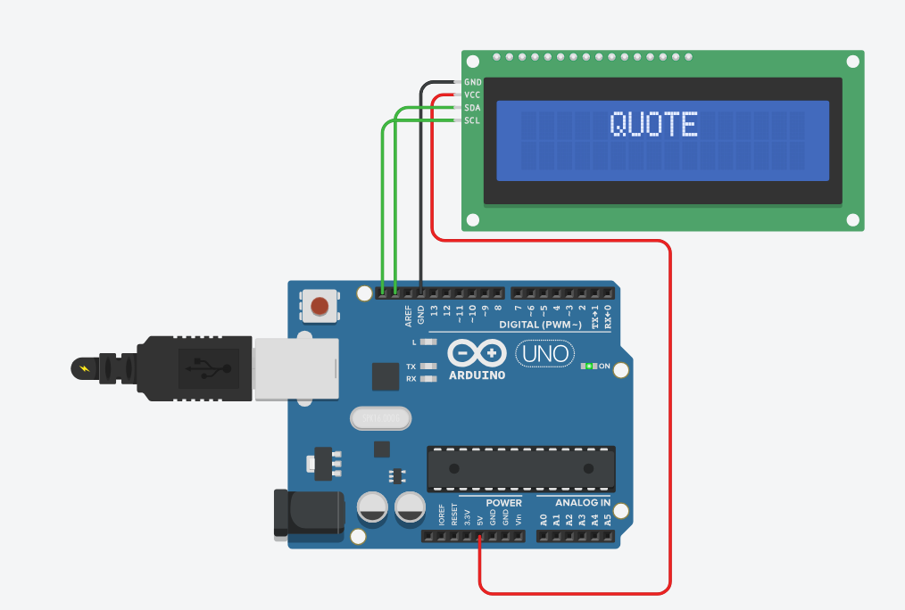

# Laporan Tugas Sistem Tertanam - Modul 6

## Implementasi Scrolling Text pada I2C Liquid Crystal Display (LCD)

- **Nama:** Raditya Yusuf Ramadhan
- **NIM:** H1D023056
- **Program Studi:** Informatika

---

### 1. Deskripsi Proyek

Proyek ini bertujuan untuk menampilkan informasi pada LCD 16x2 menggunakan protokol komunikasi I2C. Sistem dirancang untuk menampilkan teks statis di baris pertama dan teks berjalan (scrolling text) di baris kedua.

**Spesifikasi Tampilan:**

- **Baris 0 (Atas):** Menampilkan teks "QUOTE" secara statis tepat di tengah layar.
- **Baris 1 (Bawah):** Menampilkan kutipan (quote) dinamis yang muncul dari sisi kanan layar dan bergerak ke arah kiri (Running Text).

---

### 2. Rangkaian Hardware (Simulasi)

Berikut adalah rangkaian yang dibuat menggunakan simulator Tinkercad:

**Tautan Simulasi:**
[Klik di sini untuk melihat simulasi di Tinkercad]
https://www.tinkercad.com/things/2wymrnXwEVv-scrolling-text-pada-i2c-liquid-crystal-display-lcd?sharecode=3f5zUfI9vYVRBVdbZwPxNfcBrhkQ16FCQoFssd90mus

---

### 3. Penjelasan Kode Program

Program ini menggunakan library `Adafruit_LiquidCrystal` untuk mengontrol LCD melalui I2C. Fitur utama dalam kode ini adalah penggunaan metode **Substring Windowing** untuk menciptakan efek teks berjalan yang halus.

#### Logika Utama:

1.  **Inisialisasi I2C:** Menggunakan alamat `0` sesuai dengan konfigurasi simulator untuk komunikasi data.
2.  **Teks Statis:** Menggunakan fungsi `lcd.setCursor(5, 0)` untuk menempatkan kata "QUOTE" di tengah baris atas.
3.  **Running Text (Baris 2):** \* Menambahkan 16 spasi kosong di awal dan akhir kalimat utama agar teks seolah-olah masuk dan keluar layar dengan rapi.
    - Menggunakan perulangan `for` untuk memotong (substring) kalimat sepanjang 16 karakter dan menampilkannya di baris bawah setiap 150ms.
    - Metode ini dipilih untuk menghindari kedipan (_flicker_) pada layar yang biasanya muncul jika menggunakan perintah `lcd.clear()`.

#### Potongan Kode:

```cpp
// Contoh logika substring windowing yang digunakan
for (int i = 0; i <= textBerjalan.length() - 16; i++) {
    lcd.setCursor(0, 1);
    lcd.print(textBerjalan.substring(i, i + 16));
    delay(150);
}
```
