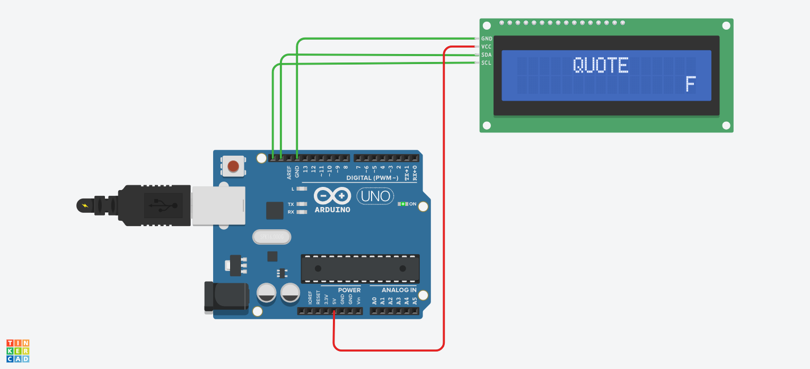

# Folder Dokumentasi

Folder ini berisikan dokumentasi penerapan code **scrolling text pada LCD 16x2 I2C** yang telah disimulasikan menggunakan **Tinkercad**. Dokumentasi ini bertujuan untuk menunjukkan hasil implementasi program, rangkaian yang digunakan, serta keluaran sistem saat simulasi dijalankan.

## Gambar Rangkaian

Berikut merupakan gambar rangkaian simulasi LCD 16x2 I2C yang digunakan pada program.

## Video Demo

Berikut merupakan video demo hasil simulasi program saat dijalankan.

[Klik untuk melihat video demo](0412.gif)

## Deskripsi Hasil Simulasi

Berdasarkan simulasi yang telah dilakukan, program berhasil menampilkan tulisan **"QUOTE"** pada baris pertama LCD secara statis. Pada baris kedua, teks kutipan ditampilkan dalam bentuk **scrolling text** dari kanan ke kiri. Pergerakan teks berlangsung secara terus-menerus sesuai dengan logika program yang dibuat. Hasil ini menunjukkan bahwa penggunaan library `Wire.h` dan `Adafruit_LiquidCrystal.h` telah berhasil diterapkan untuk mengontrol LCD 16x2 berbasis I2C.

## Link Tinkercad
<iframe width="725" height="453" src="https://www.tinkercad.com/embed/cMkk1XvuU49?editbtn=1" frameborder="0" marginwidth="0" marginheight="0" scrolling="no"></iframe>
