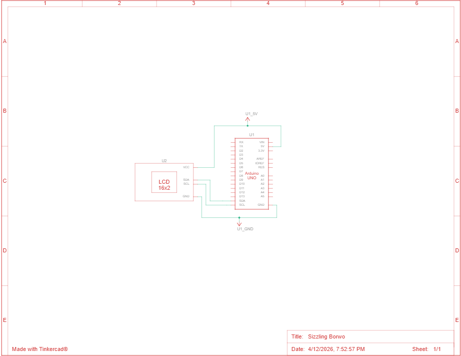

# Dokumentasi Proyek - LCD Scrolling Text dengan Arduino

## Schematic Diagram
Berikut adalah gambar rangkaian schematic pada simulasi.

### Deskripsi Schematic:
Diagram ini menunjukkan koneksi antara **Arduino UNO** dan **LCD 16x2 dengan I2C Module**. Protokol komunikasi yang digunakan adalah **I2C (Inter-Integrated Circuit)** yang memungkinkan komunikasi dengan hanya 2 kabel data.

---
## Video Simulasi
Video berikut merupakan simulasi hasil rangkaian scrolling text

### Hasil

**Baris 1 LCD:** Menampilkan "QUOTE" static di tengah  
**Baris 2 LCD:** Menampilkan quote yang berscroll dari kanan ke kiri  
**Frekuensi:** Scroll berulang terus-menerus  
**Backlight:** Menyala terang memudahkan membaca