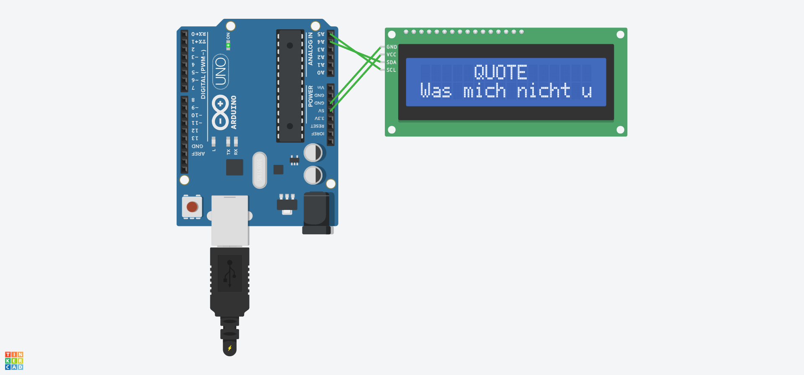

<h1>Scrolling Text Dengan I2C</h1>

## Identitas
```
Nama        : Daiva Paundra Gevano
NIM         : H1D023075
Mata Kuliah : Pemrograman Sistem Tertanam A
```

## Deskripsi Singkat

Project ini menampilkan teks scrolling pada LCD 16x2 menggunakan protokol komunikasi I2C. Teks bergerak dari kanan ke kiri dengan efek scrolling yang dinamis, sementara judul "QUOTE" tetap statis di baris pertama LCD.

## Spesifikasi Sistem

- Terdiri dari 2 Kalimat
- Baris [0]: "QUOTE" - statis, berada di tengah layar
- Baris [1]: Quote yang bergerak scroll dari kanan ke kiri (dinamis)
- Kecepatan scroll: 300ms per frame

## Alat dan Bahan

| Komponen | Jumlah | Fungsi |
|----------|--------|--------|
| Arduino UNO | 1 | Microcontroller utama |
| LCD 16x2 PCF8574 (I2C) | 1 | Display untuk menampilkan teks |
| Kabel Jumper (M2M) | 4 | Penghubung (GND, VCC, SDA, SCL) |
| Power Supply/USB | 1 | Sumber daya Arduino |

## Koneksi I2C

- **GND** (Arduino) → GND (LCD)
- **5V** (Arduino) → VCC (LCD)
- **A4** (Arduino) → SDA (LCD)
- **A5** (Arduino) → SCL (LCD)

## Hasil TinkerCAD Simulation



## Video Demonstrasi

https://github.com/user-attachments/assets/97d7f622-7775-4309-828e-4875dac02d19

## Link TinkerCAD

[Buka Project di TinkerCAD](https://www.tinkercad.com/things/34fEFUaPJzU/editel?returnTo=%2Fdashboard&sharecode=ng2uExt5PYNjPI8Z0uNshAmbvfOqIfC5Mb4c22POhvk)
