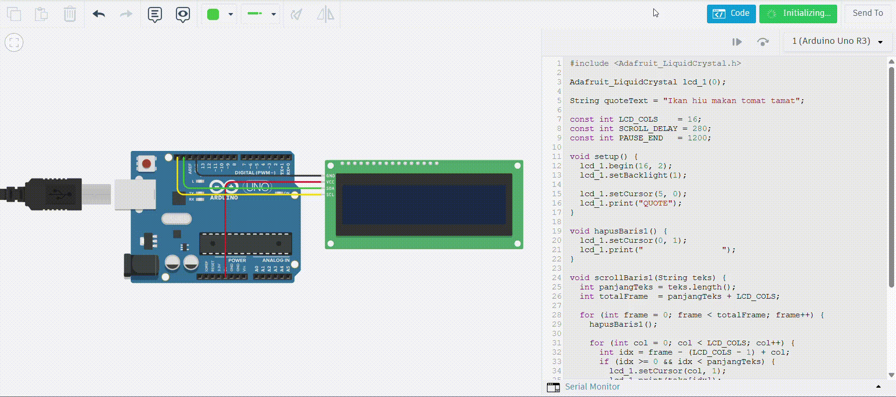

# 📜 Scrolling Text dengan I2C LCD

> **Pemrograman Sistem Tertanam**  
> Nama  : Aditya Fathan Naufaldi
> NIM   : H1D023076

---

## Video Demo



---

## 📋 Deskripsi Proyek

Proyek ini merupakan simulasi sistem **scrolling text** pada **LCD 16x2** menggunakan protokol komunikasi **I2C** dengan **Arduino Uno** yang diprogram menggunakan bahasa C/C++ dan disimulasikan menggunakan **Tinkercad** atau **Wokwi**. Sistem menampilkan dua baris teks: baris pertama menampilkan tulisan `QUOTE` secara statis dan tepat di tengah layar, sementara baris kedua menampilkan isi kutipan yang bergerak (scrolling) dari sisi kanan ke kiri secara berulang.

Proyek ini menerapkan konsep **komunikasi I2C**, **manipulasi karakter LCD berbasis frame**, serta teknik **non-blocking display** menggunakan logika frame-based scrolling tanpa `delay()` yang berlebihan.

---

## 🎯 Tujuan Pembelajaran

- Memahami konsep **komunikasi I2C** sebagai protokol serial 2-kabel (SDA & SCL)
- Menguasai penggunaan library **Adafruit LiquidCrystal** untuk LCD berbasis I2C
- Mengimplementasikan algoritma **scrolling teks berbasis frame** pada display LCD
- Merancang tampilan LCD dengan teks statis dan dinamis secara bersamaan
- Menguji simulasi rangkaian menggunakan **Tinkercad** atau **Wokwi**

---

## ⚙️ Spesifikasi Sistem

| Parameter | Keterangan |
|---|---|
| Platform | Arduino Uno |
| Display | LCD 16x2 dengan I2C backpack (PCF8574) |
| Library | Adafruit LiquidCrystal |
| I2C Address | `0x20` (index 0, semua jumper A0–A2 = LOW) |
| Baris [0] | Tulisan `QUOTE` — statis, posisi tengah (kolom 5) |
| Baris [1] | Isi kutipan — dinamis, scrolling dari kanan ke kiri |
| Lebar Kolom LCD | 16 karakter |
| Scroll Delay | 280 ms per frame |
| Pause Akhir | 1200 ms setelah teks selesai scroll |

---

## 🔌 Pemetaan Pin Arduino

| Komponen | Pin Modul I2C | Pin Arduino Uno |
|---|---|---|
| **Data Serial** | SDA | A4 |
| **Clock Serial** | SCL | A5 |
| **Tegangan** | VCC | 5V |
| **Ground** | GND | GND |

> **Catatan:** Seluruh koneksi LCD ke Arduino hanya memerlukan **4 kabel** berkat protokol I2C. Tidak diperlukan kabel data paralel (D0–D7, RS, EN).

---

## 🏗️ Struktur Kode

```
scrolling_text_i2c.ino
│
├── Inisialisasi Library & Objek (Adafruit_LiquidCrystal lcd_1)
├── Variabel Global (quoteText, LCD_COLS, SCROLL_DELAY, PAUSE_END)
├── setup()          → Inisialisasi LCD, backlight, tampilkan "QUOTE" statis
├── loop()           → Panggil scrollBaris1() secara berulang
├── hapusBaris1()    → Bersihkan baris [1] dengan 16 spasi
└── scrollBaris1()   → Algoritma scrolling frame-by-frame pada baris [1]
```

### Penjelasan Fungsi Utama

#### `setup()`
Dijalankan sekali saat Arduino menyala. Menginisialisasi LCD dengan ukuran 16x2, mengaktifkan backlight, kemudian mencetak tulisan `QUOTE` pada posisi kolom 5 baris 0 sehingga tepat berada di tengah layar.

#### `loop()`
Berjalan terus-menerus. Memanggil fungsi `scrollBaris1()` secara berulang sehingga teks kutipan terus menerus bergerak dari kanan ke kiri setiap kali satu siklus scroll selesai.

#### `hapusBaris1()`
Membersihkan seluruh karakter pada baris [1] dengan mencetak 16 karakter spasi mulai dari kolom 0. Dipanggil setiap frame sebelum karakter baru ditampilkan untuk mencegah artefak karakter sebelumnya.

#### `scrollBaris1(String teks)`
Fungsi utama yang mengimplementasikan algoritma scrolling berbasis frame. Total frame yang dijalankan adalah `panjangTeks + LCD_COLS`, sehingga teks masuk dari sisi kanan dan keluar sepenuhnya dari sisi kiri. Setiap frame, fungsi menghitung indeks karakter yang tepat untuk ditampilkan pada setiap kolom LCD menggunakan rumus `idx = frame - (LCD_COLS - 1) + col`, lalu menampilkannya hanya jika indeks tersebut valid dalam rentang teks.

---

## 🔄 Diagram Alur Sistem

```
[START]
   │
   ▼
[setup()]
LCD init → Backlight ON → Tampilkan "QUOTE" di kolom 5, baris 0
   │
   ▼
[loop()]  ←─────────────────────────────┐
   │                                    │
   ▼                                    │
[scrollBaris1()]                        │
   │                                    │
   ├── frame = 0                        │
   │     │                              │
   │     ▼                              │
   │  [hapusBaris1()]                   │
   │  Hitung & cetak karakter           │
   │  pada setiap kolom yang valid      │
   │  delay(SCROLL_DELAY = 280ms)       │
   │     │                              │
   │     ▼                              │
   │  frame++                           │
   │     │                              │
   │  frame < (panjangTeks + LCD_COLS)? │
   │  YA ──→ ulangi                     │
   │  TIDAK                             │
   │     │                              │
   │     ▼                              │
   │  delay(PAUSE_END = 1200ms)         │
   │                                    │
   └────────────────────────────────────┘
```

---

## 🖥️ Cara Menjalankan Simulasi

### Menggunakan Tinkercad
1. Buka [Tinkercad](https://www.tinkercad.com) → pilih **Circuits**
2. Tambahkan komponen: **1x Arduino Uno**, **1x LCD 16x2 I2C** (atau LCD 16x2 + modul PCF8574 backpack)
3. Hubungkan komponen sesuai tabel pemetaan pin di atas (hanya 4 kabel)
4. Salin isi file `scrolling_text_i2c.ino` ke editor kode Tinkercad
5. Tambahkan library **Adafruit LiquidCrystal** melalui menu Libraries
6. Klik **Start Simulation** dan amati teks scrolling pada layar LCD

### Menggunakan Wokwi
1. Buka [Wokwi](https://wokwi.com) → buat project **Arduino Uno**
2. Klik tombol `+` → cari dan tambahkan **LCD 1602 I2C**
3. Wokwi akan otomatis menyambungkan pin I2C ke A4 (SDA) dan A5 (SCL)
4. Salin kode ke editor, lalu tambahkan di `libraries.txt`:
   ```
   Adafruit LiquidCrystal
   ```
5. Klik **▶ Start** untuk menjalankan simulasi

> **Troubleshooting:** Jika LCD tidak menampilkan teks, coba ganti parameter konstruktor dari `lcd_1(0)` menjadi `lcd_1(1)` yang setara dengan alamat I2C `0x21` (jumper A0 = HIGH).

---

## ✅ Hasil yang Dicapai

- [x] LCD berhasil diinisialisasi menggunakan protokol I2C dengan library Adafruit LiquidCrystal
- [x] Tulisan `QUOTE` tampil statis dan tepat di tengah layar pada baris [0] kolom 5
- [x] Teks kutipan muncul dari sisi kanan (kolom 15) dan bergerak ke kiri secara mulus
- [x] Algoritma frame-based scrolling bekerja dengan benar untuk teks yang lebih panjang dari 16 karakter
- [x] Setiap frame dibersihkan terlebih dahulu oleh `hapusBaris1()` sebelum karakter baru dicetak
- [x] Teks kembali scroll dari awal setelah jeda `PAUSE_END` (1200ms) secara otomatis
- [x] Koneksi hanya memerlukan 4 kabel berkat protokol I2C (VCC, GND, SDA, SCL)

---

## 🛠️ Tools & Teknologi

| Tool | Kegunaan |
|---|---|
| Arduino Uno | Mikrokontroler utama |
| LCD 16x2 + I2C Backpack (PCF8574) | Display output |
| Arduino IDE | Penulisan dan upload kode |
| Tinkercad / Wokwi | Simulasi rangkaian online |
| C/C++ (Arduino) | Bahasa pemrograman |
| Adafruit LiquidCrystal | Library komunikasi LCD via I2C |
| GitHub | Version control & dokumentasi |