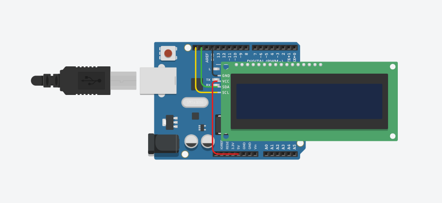

# TUGAS 06 - SCROLLING TEKS LCD 16x2 I2C

## IDENTITAS

* **Nama:** Afif Nur Rahman
* **NIM:** H1H024016
* **Mata Kuliah:** Sistem Mikrokontroler 

## DESKRIPSI PROYEK

Proyek ini dibuat untuk menampilkan teks berjalan (scrolling text) pada layar LCD 16x2 I2C (sebagai protokol komunikasi serial). Baris yang pertama menampilkan QUOTE atau text secara statis, sedangkan baris kedua menampilkan kutipan quote/motivasi yang bergerak.

## RANGKAIAN

### Komponen

| Komponen         | Jumlah |
|------------------|--------|
| Arduino Uno      | 1      |
| LCD 16×2 + Modul I2C (MCP23008) | 1 |
| Kabel Jumper     | 4      |

### Pin Koneksi

| Pin LCD (Modul I2C) | Pin Arduino Uno |
|---------------------|-----------------|
| GND                 | GND             |
| VCC                 | 5V              |
| SDA                 | SDA Arduino     |
| SCL                 | SCL Arduino     |

### Skema Rangkaian



## PENJELASAN KODE
```
#include <Adafruit_LiquidCrystal.h> 
// Memanggil library untuk mengontrol LCD (via I2C atau pin biasa)

Adafruit_LiquidCrystal lcd_1(0); 
// Membuat objek LCD dengan alamat I2C 0 (biasanya 0x20 atau default library)

// Teks yang akan ditampilkan di baris atas (judul)
String atas  = "KATA - KATA:";

// Teks panjang yang akan di-scroll di baris bawah
String bawah = "FA INNA MA'AL USRI YUSRO, INNA MA'AL USRI YUSRO";

// Variabel untuk menentukan posisi awal karakter yang ditampilkan
int posisi = 0;

void setup()
{
  lcd_1.begin(16, 2); 
  // Menginisialisasi LCD dengan ukuran 16 kolom dan 2 baris

  lcd_1.setBacklight(1); 
  // Menyalakan backlight LCD (lampu latar)

  int panjang = atas.length(); 
  // Menghitung jumlah karakter pada teks "atas"

  int tengah = (16 - panjang) / 2; 
  // Menghitung posisi agar teks "atas" berada di tengah layar

  lcd_1.setCursor(tengah, 0); 
  // Mengatur kursor ke baris pertama (0) dan kolom tengah

  lcd_1.print(atas); 
  // Menampilkan teks "KATA - KATA:" di baris atas
}

void loop()
{
  lcd_1.setCursor(0, 1); 
  // Mengatur kursor ke kolom 0, baris kedua (untuk scrolling)

  // Mengambil 16 karakter dari string "bawah" mulai dari posisi tertentu
  String tampil = bawah.substring(posisi, posisi + 16);

  lcd_1.print(tampil); 
  // Menampilkan potongan teks ke LCD

  posisi++; 
  // Geser posisi agar teks terlihat berjalan (scroll ke kiri)

  // Jika sudah mencapai akhir teks, ulang dari awal
  if (posisi > bawah.length() - 16) {
    posisi = 0;
  }

  delay(300); 
  // Delay 300 ms supaya scrolling tidak terlalu cepat
}
```

## DEMO

<video controls src="2026-04-12 18-57-21.mp4" title="Title"></video>

## LINK SIMULASI (TINKERCAD)

[https://www.tinkercad.com/things/kq0vIEwWdxs-tugas-06sismik-aafif-nur-rahmanh1h024016](https://www.tinkercad.com/things/kq0vIEwWdxs-tugas-06sismik-aafif-nur-rahmanh1h024016)

