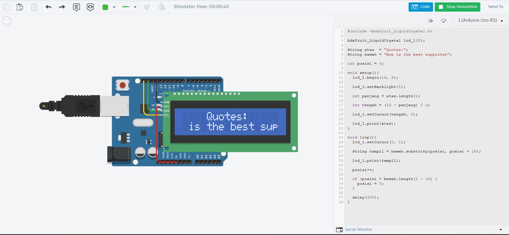

# TUGAS 06 - SCROLLING TEKS LCD 16x2 I2C

## IDENTITAS

* **Nama:** Windi Sulaiman Ismansa
* **NIM:** H1H024005
* **Mata Kuliah:** Sistem Mikrokontroler 

## DESKRIPSI PROYEK

proyek ini memanfaatkan LCD 16x2 melalui interface I2C untuk menjalankan dua mode tampilan teks yaitu berupa teks statis pada baris pertama dan teks dinamis atau scrolling pada baris kedua untuk menampilkan Quotes motivasi yang berjalan dari sisi kanan ke sisi kiri.

## RANGKAIAN

### Komponen

| Komponen         | Jumlah |
|------------------|--------|
| Arduino Uno      | 1      |
| LCD 16×2 + Modul I2C (MCP23008) | 1 |
| Kabel Jumper     | 4      |

### Pin Koneksi

| Pin LCD (Modul I2C) | Pin Arduino Uno |
|---------------------|-----------------|
| GND                 | GND             |
| VCC                 | 5V              |
| SDA                 | SDA Arduino     |
| SCL                 | SCL Arduino     |

### Skema Rangkaian



## PENJELASAN KODE
```
#include <Adafruit_LiquidCrystal.h> 
// Memasukkan library Adafruit untuk mengendalikan LCD

Adafruit_LiquidCrystal lcd_1(0); 
// Membuat objek LCD dengan alamat I2C = 0

String atas  = "Quotes:";
// Teks yang ditampilkan di baris atas LCD

String bawah = "Mom is the best supporter";
// Teks yang akan discroll di baris bawah LCD

int posisi = 0;
// Variabel untuk menyimpan posisi awal teks yang discroll

void setup(){
  lcd_1.begin(16, 2); 
  // Menginisialisasi LCD dengan ukuran 16 kolom dan 2 baris

  lcd_1.setBacklight(1); 
  // Menyalakan lampu latar (backlight) LCD

  int panjang = atas.length(); 
  // Menghitung panjang karakter string "atas"

  int tengah = (16 - panjang) / 2; 
  // Menghitung posisi cursor agar teks tampil di tengah

  lcd_1.setCursor(tengah, 0); 
  // Memindahkan cursor ke kolom tengah, baris 0 (atas)

  lcd_1.print(atas); 
  // Mencetak teks "Quotes:" di baris atas LCD
}

void loop(){
  lcd_1.setCursor(0, 1); 
  // Memindahkan cursor ke kolom 0, baris 1 (bawah)

  String tampil = bawah.substring(posisi, posisi + 16);
  // Mengambil 16 karakter dari string "bawah" mulai dari posisi saat ini

  lcd_1.print(tampil); 
  // Menampilkan potongan teks tersebut di baris bawah LCD

  posisi++; 
  // Menggeser posisi teks satu karakter ke kanan (efek scroll)

  if (posisi > bawah.length() - 16) {
  // Mengecek apakah teks sudah mencapai akhir string

    posisi = 0;
    // Mereset posisi ke awal agar teks scroll dari ulang
  }

  delay(300); 
  // Menunggu 300 milidetik sebelum menggeser teks kembali
}
```

## DEMO

https://github.com/user-attachments/assets/9d690195-86a5-4018-8ea2-1346d7c028c3

## LINK SIMULASI (TINKERCAD)

[https://www.tinkercad.com/things/gs8z9fQYmeS-tugas6](https://www.tinkercad.com/things/gs8z9fQYmeS-tugas6)

