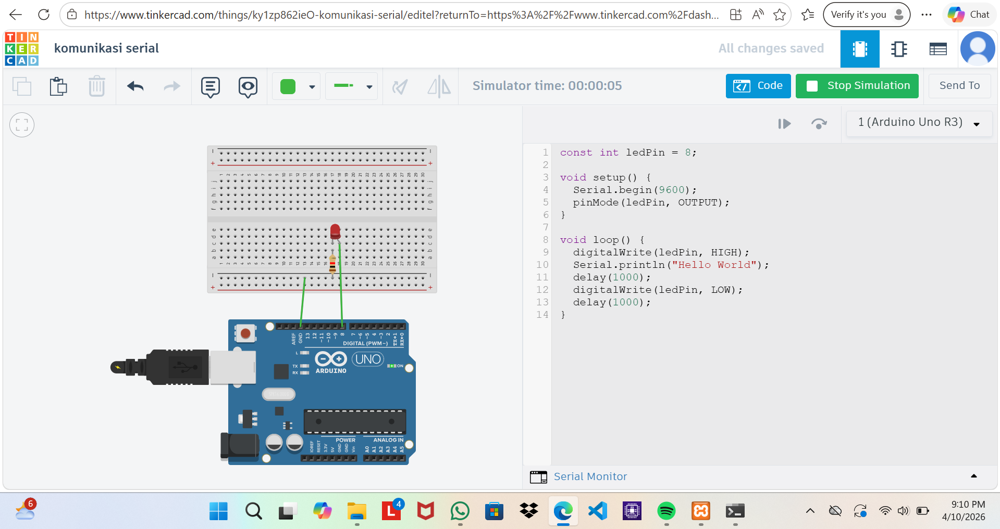
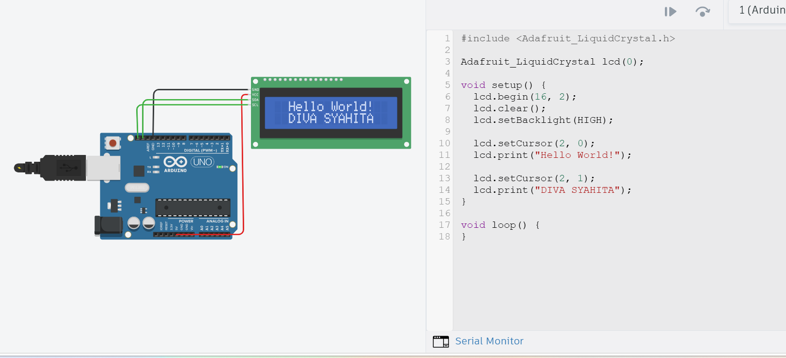
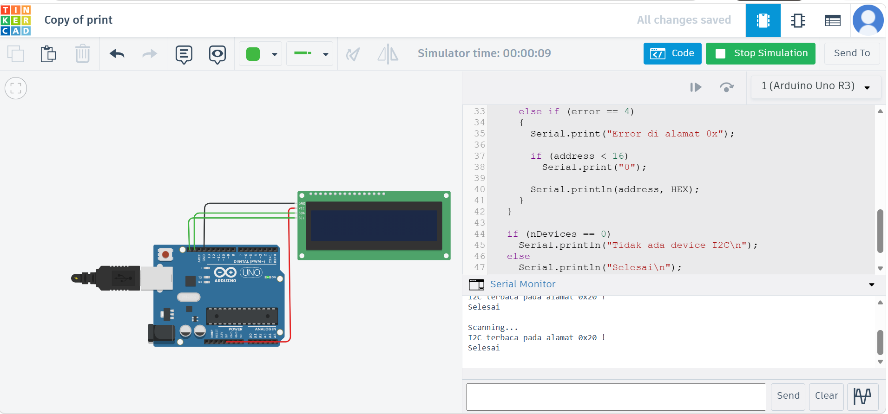
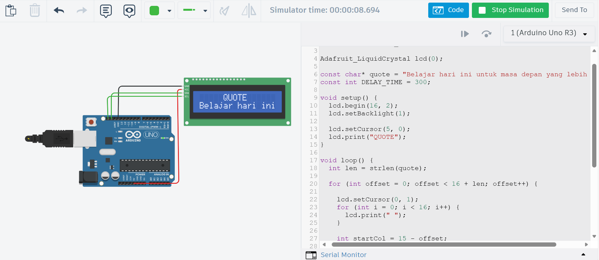

# Dokumentasi Simulasi Arduino (Tinkercad)
## Platform yang Digunakan

* **Tinkercad Circuits** → untuk simulasi rangkaian dan Arduino

---

## Percobaan 1: Komunikasi Serial

### Deskripsi

Program ini bertujuan untuk menampilkan komunikasi serial berupa teks **"Hello World"** serta mengontrol LED yang berkedip setiap 1 detik.

### Alur Kerja
1. Membuat rangkaian Arduino Uno
2. Menghubungkan LED ke pin digital 8
3. Mengaktifkan komunikasi serial (`Serial.begin`)
4. Program dijalankan:
   - LED menyala → kirim "Hello World"
   - LED mati → delay
5. Output muncul di Serial Monitor


### Hasil Simulasi

LED menyala dan mati secara bergantian (blink)
Serial Monitor menampilkan:

  ```
  Hello World
  ```

### Dokumentasi


[video simulasi](komunikasi_data.mp4)

### Link Simulasi

> [Link Tinkercad](https://www.tinkercad.com/things/ky1zp862ieO-komunikasi-serial?sharecode=RFGBYgR4LP3ChjAOIWYi_J5GlcpBwiIy8pQptH2Hdso)

---

## Percobaan 2: I2C LCD Print (l2c_print)

### Deskripsi

Program ini digunakan untuk menampilkan teks statis pada LCD 16x2 berbasis I2C.

### Alur Kerja
1. Menambahkan LCD I2C
2. Menghubungkan:
 - VCC → 5V  
 - GND → GND  
 - SDA → A4  
 - SCL → A5  
3. Menggunakan library `Adafruit_LiquidCrystal`
4. Inisialisasi LCD
5. Menampilkan teks

### Hasil Simulasi

LCD menampilkan:

  * Baris 1: **Hello World!**
  * Baris 2: **DIVA SYAHITA**

### Dokumentasi


[video simulasi](print.mp4)

### Link Simulasi

> [Link Tinkercad](https://www.tinkercad.com/things/d3XiMj3Qmm9-print?sharecode=-E1ibxBb4Bj-QADF_Lxb8rIX0CNt1waC9DO33XSG8BQ)

---

## Percobaan 3: I2C Scanner (l2c_scanning)

### Deskripsi

Program ini digunakan untuk mendeteksi alamat perangkat yang terhubung melalui protokol **I2C (Inter-Integrated Circuit)**.

### Alur Kerja
1. Menyusun rangkaian Arduino + LCD I2C
2. Mengaktifkan `Wire.begin()`
3. Melakukan scanning alamat 1–127
4. Jika device terdeteksi → tampil di Serial Monitor
5. Diulang setiap beberapa detik

### Hasil Simulasi

Serial Monitor menampilkan hasil scanning alamat I2C
Contoh output:

  ```
  Scanning...
  I2C terbaca pada alamat 0x20 !
  Selesai
  ```

### Dokumentasi


[video simulasi](scanning.mp4)

### Link Simulasi

> [Link Tinkercad](https://www.tinkercad.com/things/ih0X2BTRzaQ-scanning?sharecode=WMNCekk7Ur-TA_HpYM1UmV0pHMEexOpW7NX7zBXlOvU)

---

## Percobaan 4: I2C LCD Scrolling (l2c_scrolling)

### Deskripsi

Program ini menampilkan teks berjalan (scrolling text) pada LCD I2C.

### Alur Kerja
1. Menghubungkan LCD seperti sebelumnya
2. Menentukan teks dalam variabel `quote`
3. Menggunakan looping untuk menggeser teks
4. Membersihkan baris LCD setiap iterasi
5. Menampilkan teks bergerak dari kanan ke kiri

### Hasil Simulasi

Baris pertama menampilkan: **QUOTE**
Baris kedua menampilkan teks berjalan:

  ```
  Belajar hari ini untuk masa depan yang lebih baik
  ```

### Dokumentasi


[video simulasi](scanning.mp4)

### Link Simulasi

> [Link Tinkercad](https://www.tinkercad.com/things/97cUtsMGvsT-scrolling?sharecode=O0QZ0G3IEhOuA2rhnoYwRGFLNrrwYwAtkXkQzq8KKsg)

---

## Kesimpulan

Dari keempat percobaan yang telah dilakukan, dapat disimpulkan bahwa:

* Komunikasi serial dapat digunakan untuk monitoring data dari Arduino
* LCD berbasis I2C mempermudah penggunaan karena hanya membutuhkan sedikit pin
* Scanner I2C membantu mengetahui alamat device sebelum digunakan
* LCD dapat digunakan untuk menampilkan teks statis maupun dinamis (scrolling)

---
