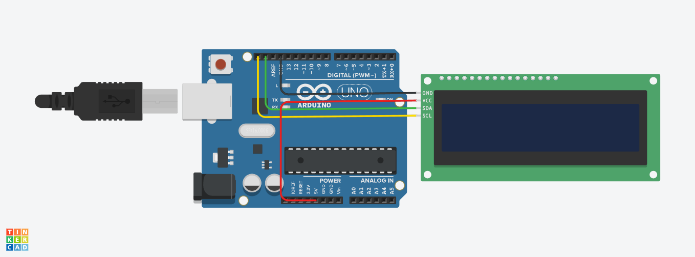

# Scrolling Text LCD I2C Arduino

## Deskripsi
Program ini digunakan untuk menampilkan teks pada LCD 16x2 menggunakan modul I2C.  
Tampilan terdiri dari:
- Baris pertama: teks **"QUOTE"** (statis dan berada di tengah)
- Baris kedua: teks berjalan (scrolling) secara dinamis

---

## Penggunaan Library

### 1. Wire.h
Digunakan untuk komunikasi I2C antara Arduino dan LCD.

### 2. LiquidCrystal_I2C.h
Digunakan untuk mengontrol LCD berbasis I2C dengan lebih mudah.

---

## Inisialisasi

LiquidCrystal_I2C lcd(0x20, 16, 2);

Penjelasan:
- 0x20 → alamat I2C LCD  
- 16 → jumlah kolom  
- 2 → jumlah baris  

---

## Variabel

String text = "Kerja! Kerja! Kerja! Kerja! ";
int index = 0;

Penjelasan:
- text → teks yang akan ditampilkan  
- index → penentu posisi awal teks  

---

## Fungsi setup()

void setup() {
  lcd.init();
  lcd.backlight();

  String title = "QUOTE";
  int startPos = (16 - title.length()) / 2;
  lcd.setCursor(startPos, 0);
  lcd.print(title);
}

Penjelasan:
- Inisialisasi LCD dan menyalakan backlight  
- Menghitung posisi tengah teks "QUOTE"  
- Menampilkan "QUOTE" di baris pertama  

---

## Fungsi loop()

void loop() {
  lcd.setCursor(0, 1);

  String tampil = text.substring(index, index + 16);
  lcd.print(tampil);

  index++;

  if (index > text.length() - 16) {
    index = 0;
  }

  delay(300);
}

Penjelasan:
- Menampilkan potongan 16 karakter dari teks  
- index++ membuat teks bergerak (scroll)  
- Jika teks habis, akan diulang dari awal  
- delay(300) mengatur kecepatan scroll  

---

## Desain Rangkaian

Berikut adalah tampilan rangkaian pada Tinkercad:

---

## Link Simulasi Tinkercad
Klik link berikut untuk melihat dan menjalankan simulasi:

https://www.tinkercad.com/things/30Eyh4UelrF-scrolling-text-i2c

---

## Kesimpulan
Program ini menggunakan metode substring untuk membuat teks berjalan pada LCD. Metode ini lebih halus dan stabil dibandingkan dengan pergeseran kursor biasa.
